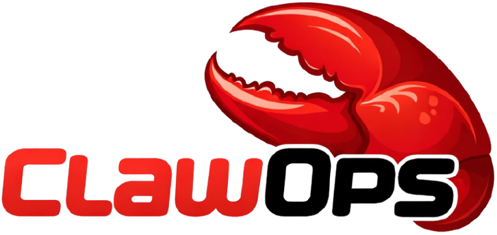

<p align="center">
  
</p>

<h1 align="center">ClawOps</h1>

<p align="center">
  Open-source DevOps control plane for managing AI agent infrastructure.
  <br>
  Servers &middot; SSH &middot; Secrets &middot; Domains &middot; SSL &middot; Deployments &middot; Agent Templates
</p>

<p align="center">
  
  
  
  
</p>

---

## What is ClawOps?

ClawOps is an open-source infrastructure control plane built for teams running AI agent workloads. It gives you a single web interface to manage your entire server fleet — from initial registration through domain provisioning to production deployments.

The core pattern is simple: **Java backend orchestrates -> uploads script -> executes via SSH -> tracks status**. No agents, daemons, or proprietary software needs to be installed on your remote servers. All you need is SSH access.

ClawOps was designed for the [OpenClaw](https://github.com/openclaw) ecosystem but works with any server infrastructure where you need centralized management of SSH-accessible machines.

## Features

- **Server Registry** — Register servers by hostname/IP, authenticate with SSH key or password, tag by environment
- **Encrypted Secrets** — AES-256-GCM encrypted storage for SSH private keys, passwords, and API tokens
- **DNS Automation** — Cloudflare and Namecheap provider support; auto-import all domains from an account; auto-create subdomains when servers are registered
- **SSL Automation** — Automatic Let's Encrypt certificates via certbot with nginx reverse proxy on every managed server
- **Script Library** — Write and store bash deployment scripts in the database, run them on any server with one click, view live logs
- **Agent Templates** — Bash scripts that install OpenClaw agent directory structures with markdown config files for agents and their skills
- **WebSocket Terminal** — Live browser-based SSH terminal to any managed server
- **Audit Log** — Every operation logged with user, timestamp, IP address, and detail
- **JWT Authentication** — Short-lived access tokens + long-lived refresh tokens, ADMIN and DEVOPS roles
- **Swagger UI** — Full interactive OpenAPI documentation at `/swagger-ui.html`

## Tech Stack

| Layer | Technology |
|-------|-----------|
| Language | Java 21 |
| Framework | Spring Boot 4.0.3 |
| Database | PostgreSQL 17 + Flyway migrations |
| Auth | Spring Security + JWT (access + refresh tokens) |
| SSH | sshj 0.39 |
| WebSocket | Spring WebSocket (STOMP) |
| API Docs | springdoc-openapi 3.0.2 (Swagger UI) |
| Frontend | Vanilla HTML/CSS/JS dev admin panel |

## Quick Start

### Using Docker Compose (recommended)

```bash
git clone https://github.com/your-org/clawops.git
cd clawops
cp .env.example .env           # fill in MASTER_ENCRYPTION_KEY, JWT_SECRET, etc.
docker-compose up -d           # starts PostgreSQL
./mvnw spring-boot:run         # starts the application
```

### Manual Setup

**Prerequisites:** Java 21+, PostgreSQL 17+, Maven 3.9+

```bash
# 1. Create the database
createdb openclaw

# 2. Configure environment
cp .env.example .env
# Edit .env — set DB credentials, MASTER_ENCRYPTION_KEY, JWT_SECRET

# 3. Build and run
./mvnw clean install
./mvnw spring-boot:run
```

The application starts at `http://localhost:8080`. Default admin credentials are printed to the console on first startup (via `AdminBootstrapRunner`).

## Configuration

Key environment variables (see [docs/configuration.md](docs/configuration.md) for the full reference):

| Variable | Required | Default | Description |
|----------|----------|---------|-------------|
| `MASTER_ENCRYPTION_KEY` | Yes | — | 32-byte Base64 key for AES-GCM encryption (`openssl rand -base64 32`) |
| `DB_HOST` | No | `localhost` | PostgreSQL host |
| `DB_PORT` | No | `5432` | PostgreSQL port |
| `DB_NAME` | No | `openclaw` | Database name |
| `DB_USERNAME` | No | `openclaw` | Database username |
| `DB_PASSWORD` | Yes | — | Database password |
| `JWT_SECRET` | Yes | — | Secret for signing JWT tokens |
| `JWT_ACCESS_TOKEN_EXPIRATION` | No | `900000` (15m) | Access token lifetime (ms) |
| `JWT_REFRESH_TOKEN_EXPIRATION` | No | `604800000` (7d) | Refresh token lifetime (ms) |
| `SSL_ADMIN_EMAIL` | No | `admin@openclaw.com` | Email for Let's Encrypt registration |
| `SSL_TARGET_PORT` | No | `3000` | Port nginx proxies to on managed servers |
| `ADMIN_EMAIL` | No | `admin@openclaw.dev` | Bootstrap admin email |
| `ADMIN_USERNAME` | No | `admin` | Bootstrap admin username |
| `ADMIN_PASSWORD` | No | — | Bootstrap admin password |

## API Documentation

Interactive API docs are available at `/swagger-ui.html` when the application is running.

The API follows REST conventions with a base path of `/api/v1/`. All endpoints return JSON. Authentication uses Bearer JWT tokens.

See [docs/api-reference.md](docs/api-reference.md) for the complete endpoint reference with request/response examples.

## Documentation

| Document | Description |
|----------|-------------|
| [Getting Started](docs/getting-started.md) | Installation, configuration, and first-run walkthrough |
| [Architecture](docs/architecture.md) | System design, module overview, data flows |
| [API Reference](docs/api-reference.md) | All REST endpoints with examples |
| [Configuration](docs/configuration.md) | Environment variables and application properties |
| [Security](docs/security.md) | Authentication, roles, encryption details |

### Module Guides

| Module | Guide |
|--------|-------|
| Servers | [docs/modules/servers.md](docs/modules/servers.md) |
| Secrets | [docs/modules/secrets.md](docs/modules/secrets.md) |
| Domains | [docs/modules/domains.md](docs/modules/domains.md) |
| SSL | [docs/modules/ssl.md](docs/modules/ssl.md) |
| Deployments | [docs/modules/deployment.md](docs/modules/deployment.md) |
| Templates | [docs/modules/templates.md](docs/modules/templates.md) |
| Terminal | [docs/modules/terminal.md](docs/modules/terminal.md) |
| Audit | [docs/modules/audit.md](docs/modules/audit.md) |

## UI Overview

ClawOps includes a lightweight dev admin panel at `/dev/` with pages for each module:

| Page | URL | Purpose |
|------|-----|---------|
| Dashboard | `/dev/index.html` | Module overview with quick navigation |
| Servers | `/dev/servers.html` | Server inventory, connection testing, SSH commands |
| Secrets | `/dev/secrets.html` | Encrypted credential management |
| SSH & Terminal | `/dev/ssh.html` | Interactive terminal, command history |
| Domains | `/dev/domains.html` | DNS providers, zones, subdomain assignments |
| Deployments | `/dev/deployment.html` | Script library, job execution, live logs |
| Templates | `/dev/templates.html` | Agent templates, deploy to servers |
| Audit | `/dev/audit.html` | Operation audit log with filters |
| Users | `/dev/users.html` | User management (admin only) |

## Contributing

See [CONTRIBUTING.md](CONTRIBUTING.md) for guidelines on how to contribute to ClawOps.

## License

MIT License. See [LICENSE](LICENSE) for details.
